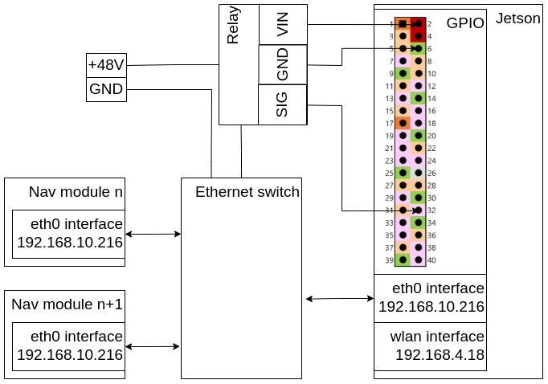

# Usage
## Reboot test:

To start reboot test, enter command `./start_reboot_test.py`. To stop, press `CTRL+C`.
To configure ips to ping, write them down in the `nav_modules_ips_to_ping.py` into list.
# Additionall info
Jetson TX2 J21 GPIO header url: https://haeyeonlab.wordpress.com/2019/09/20/2019-09-20-how-to-use-gpio-pin-on-the-jetson-tx2-board/
